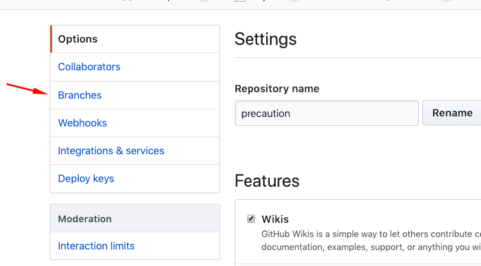
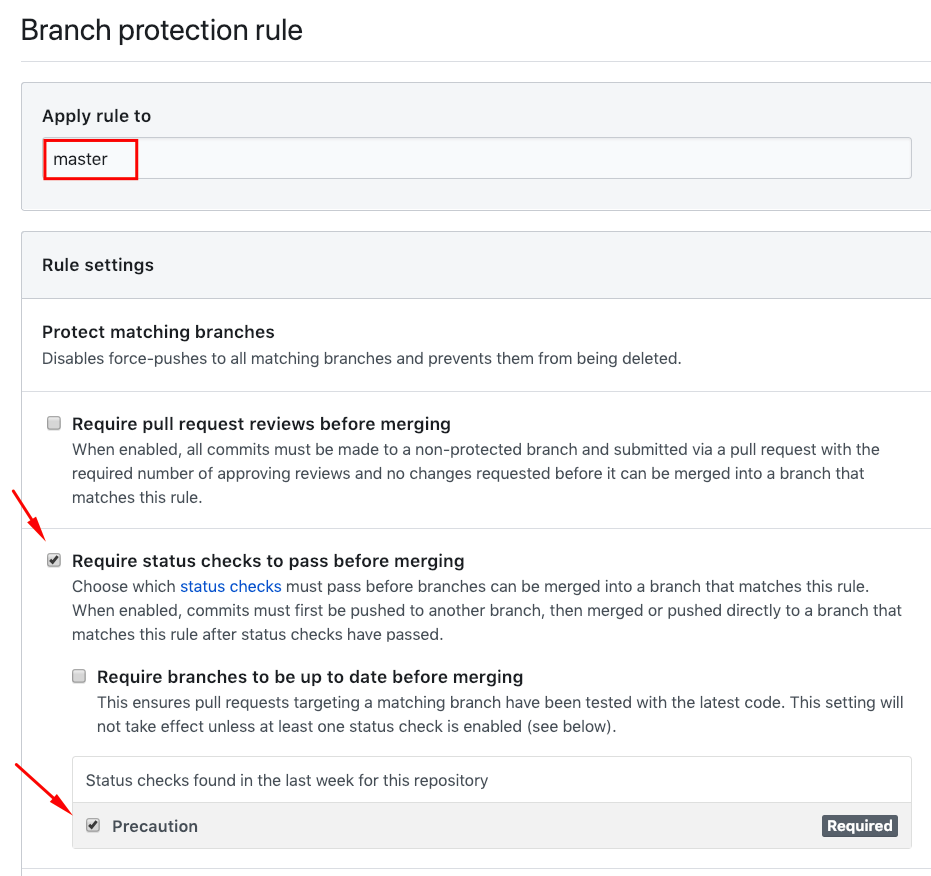

<!--
    Copyright 2019 VMware, Inc.
    SPDX-License-Identifier: BSD-2-Clause
-->

## Setting up a Branch Protection Rule

In order to allow Precaution to prevent pull requests from merging, do the following:

### 1. Create a pull request

If you follow all of the steps below without creating a pull request, unfortunately, 
you won't be able to add Precaution as a required check. 
GitHub needs a new pull request to trigger Precaution and
update the list of status checks available for your repository.

You can create a simple pull request with no real or significant changes.

This pull request doesn't have to be merged, because it's sole purpose is to update the GitHub servers.

### 2. Go to settings

### 3. Choose branches

### 4. Create a new branch protection rule 

### 5. Setup the branch protection rule 

If you want to apply this rule to the master branch you will have to check the following options:

Congratulations! Now Precaution will prevent the merging of a pull request if the check resulted in a failure status.