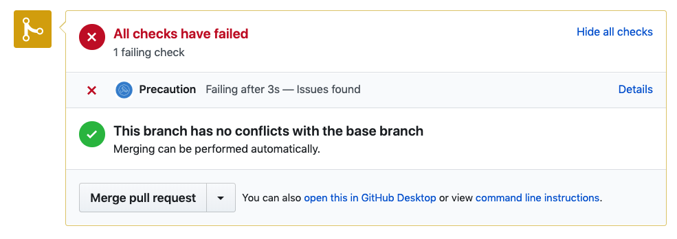

<!--
    Copyright 2019 VMware, Inc.
    SPDX-License-Identifier: BSD-2-Clause
-->

# Initial setup

## Run static code analysis locally (recommended)

In order to achieve the best results when using Precaution, it's important to run static code analysis on the codebase in your main branch locally. 
The reason to do that is that there can be many older source code files which are stable and won't be changed soon by a pull request but still it's good to ensure they don't contain common security-related mistakes.

You can run static code analysis of Python source code using Bandit: https://github.com/PyCQA/bandit 

and for source code in Go use Gosec: https://github.com/securego/gosec 

## Setting up a Branch Protection Rule

By default, after Precaution is installed, it will not automatically prevent the merging of a pull request even if the check resulted in a failure status. 

In order to allow Precaution to prevent pull requests from merging, do the following:

### 1. Create a pull request

You should create a pull request after the installation of Precaution in order to setup Precaution as a branch protection rule.

This pull request doesn't have to be merged.

### 2. Go to settings

### 3. Choose branches

### 4. Create a new branch protection rule 

### 5. Setup the branch protection rule 

If you want to apply this rule to the master branch you will have to check the following options:

Congratulations! Branch protection is now enabled and will prevent merging code that fails the status check.
